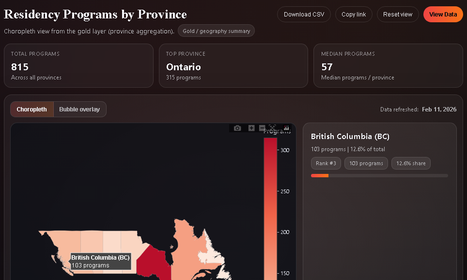
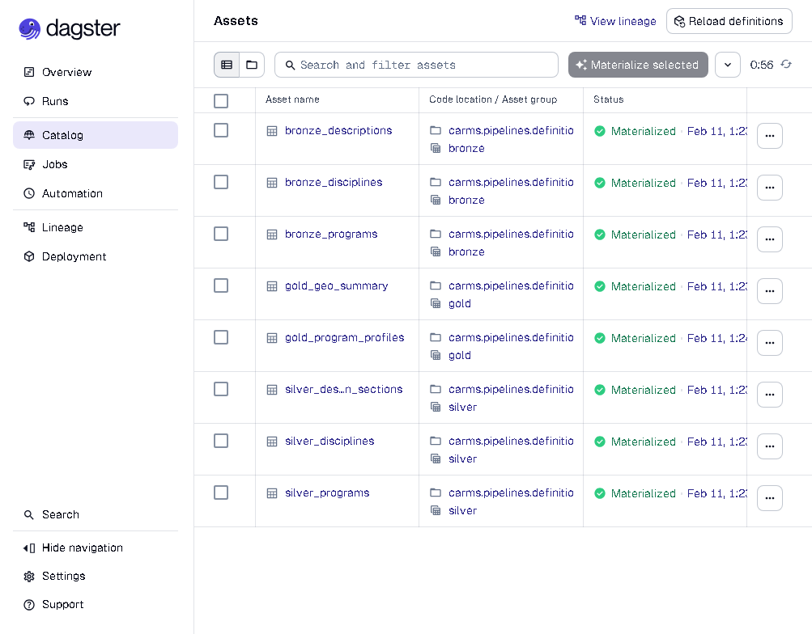

# CaRMS Analytics Platform

### What it is
An end-to-end, production-style data platform for the public CaRMS residency program dataset. It ingests raw Excel/CSV extracts, shapes them into bronze -> silver -> gold tables with Dagster and Postgres (pgvector-ready), and serves both program search APIs and a province-level choropleth map via FastAPI. The goal is to showcase systems thinking for a junior data scientist focused on data engineering, analytics, and delivery.

### Architecture (ASCII)
```
           +-------------+
           | Source CSV  |
           +------+------+
                  |
                  v
         +--------+--------+        Docker Compose
         |  Dagster Assets |        (Postgres, Dagster UI, API)
         | bronze/silver   |
         +--------+--------+
                  |
                  v
         +-----------------+   Postgres (pgvector enabled)
         |   Gold Layer    |   gold_program_profile
         |                 |   gold_geo_summary
         +--------+--------+
                  |
        +---------+---------+
        | FastAPI + SQLModel|
        +----+-----------+--+
             |           |
      /programs JSON   /map HTML (Plotly)
```

### Data layers
- bronze_program / bronze_discipline / bronze_description  raw CaRMS extracts as-is.
- silver_program  cleaned columns, province derivation, quota parsing, validity flags.
- silver_description_section  unpivoted description text per section.
- gold_program_profile  curated program metadata plus concatenated descriptions.
- gold_geo_summary  province x discipline rollups with program counts and avg quota.

### Run it in 10 minutes
1. `cp .env.example .env`
2. `docker-compose up --build`
3. Visit Dagster UI `http://localhost:3000` and run job `carms_job` (materializes bronze -> silver -> gold).
4. Check API docs at `http://localhost:8000/docs` and the map at `http://localhost:8000/map`.

### Endpoints
| Method | Path | Purpose | Key params |
|--------|------|---------|------------|
| GET | `/health` | Liveness |  |
| GET | `/programs` | List/search programs | discipline, province, school, limit, offset, include_total, preview_chars |
| GET | `/programs/{program_stream_id}` | Program detail | program_stream_id |
| GET | `/disciplines` | Active discipline lookup |  |
| POST | `/pipeline/run` | Trigger Dagster carms_job via GraphQL |  |
| GET | `/map` | Choropleth HTML |  |
| GET | `/map/data.json` | Province rollup JSON |  |
| GET | `/map/canada.geojson` | GeoJSON |  |

Security and limits (configurable via `.env`):
- X-API-Key header enforced when `API_KEY` is set.
- Rate limit: `RATE_LIMIT_REQUESTS` per `RATE_LIMIT_WINDOW_SEC` (default 120/min per client IP).

### 5-minute demo script
1) Open `/docs` and run `GET /programs-province=ON&limit=5` to show filters and pagination.  
2) Click `/programs/{id}` for a detail view with full description text.  
3) In Dagster (`http://localhost:3000`), open job `carms_job` to show the bronze/silver/gold asset graph.  
4) Open `/map`, toggle choropleth vs bubble, hover a province to show counts and share.  
5) Mention optional API key plus rate limiting and point to `docs/api-contract.md`.

### Screenshots
#### Province choropleth (program count)


#### API (FastAPI OpenAPI)


#### Pipelines (Dagster assets)



### Roadmap
- Add semantic search over `gold_program_profile` using pgvector and LangChain.
- Schedule Dagster runs with data quality checks and freshness alerts.
- Deploy a lightweight demo (RDS + ECS/Fargate or Fly) with CI (pytest + ruff).

### License
MIT
